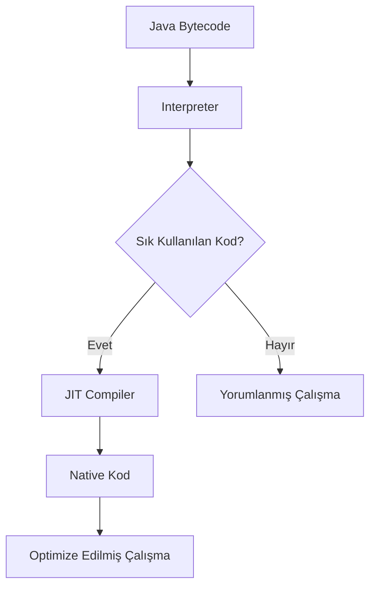

# Java Virtual Machine (JVM): Modern Bir Bakış

> "JVM, Java ekosisteminin kalbidir. Modern yazılım dünyasında performans ve güvenilirliğin sembolü haline gelmiştir."

## Hızlı Başlangıç

```java
public class QuickStart {
    public static void main(String[] args) {
        System.out.println("Modern JVM'e Hoş Geldiniz!");
    }
}
```

## İçindekiler

- [Java Virtual Machine (JVM): Modern Bir Bakış](#java-virtual-machine-jvm-modern-bir-bakış)
  - [Hızlı Başlangıç](#hızlı-başlangıç)
  - [İçindekiler](#i̇çindekiler)
  - [JVM Nedir?](#jvm-nedir)
    - [Nasıl Çalışır?](#nasıl-çalışır)
  - [JVM Mimarisi](#jvm-mimarisi)
    - [1. Class Loader Subsystem](#1-class-loader-subsystem)
    - [2. Runtime Data Areas](#2-runtime-data-areas)
    - [3. Execution Engine](#3-execution-engine)
  - [Bellek Yönetimi](#bellek-yönetimi)
  - [Garbage Collection](#garbage-collection)
  - [JIT Compiler](#jit-compiler)
    - [JIT Optimizasyon Süreci](#jit-optimizasyon-süreci)
  - [Performans İpuçları](#performans-i̇puçları)
    - [En İyi Uygulamalar](#en-i̇yi-uygulamalar)
  - [Kaynaklar ve İleri Okuma](#kaynaklar-ve-i̇leri-okuma)
  - [Katkıda Bulunun](#katkıda-bulunun)

## JVM Nedir?

JVM (Java Virtual Machine), Java programlama dilinin temel taşıdır. Bytecode'u yorumlayan ve çalıştıran bu sanal makine, Java'nın platform bağımsız olmasını sağlar. JVM, kaynak kodunun `.class` dosyalarına derlenmesinden sonra bu bytecode'u makine diline çevirerek işletim sisteminin anlayabileceği formata dönüştürür.

JVM'in temel özellikleri:

- **Platform Bağımsızlık**: Java kodunu herhangi bir platformda değişiklik yapmadan çalıştırabilme
- **Güvenlik Katmanı**: Bytecode doğrulama, güvenlik yöneticisi ve sınıf yükleyici güvenliği
- **Otomatik Bellek Yönetimi**: Garbage Collection ile manuel bellek yönetimi ihtiyacını ortadan kaldırma
- **Yüksek Performans**: JIT derleyici ve çeşitli optimizasyon teknikleri

### Nasıl Çalışır?

Java uygulaması şu adımlardan geçer:

1. Java kaynak kodu (.java) derlenir ve bytecode'a (.class) dönüştürülür
2. JVM bytecode'u yükler ve doğrular
3. Bytecode yorumlanır veya JIT ile native koda derlenir
4. İşletim sistemi seviyesinde çalıştırılır

## JVM Mimarisi

JVM mimarisi, karmaşık ve çok katmanlı bir yapıya sahiptir. Her bileşen özel bir görevi yerine getirir ve diğer bileşenlerle sıkı bir işbirliği içinde çalışır.

```ascii
+---------------------------------------------------+
|                  JAVA PROGRAMI                     |
+---------------------------------------------------+
                        |
                        v
+---------------------------------------------------+
|                  CLASS LOADER                       |
|                                                    |
|    [Bootstrap] --> [Extension] --> [Application]   |
|                                                    |
+---------------------------------------------------+
                        |
                        v
+---------------------------------------------------+
|              RUNTIME DATA AREAS                     |
|                                                    |
|    +---------------+        +-----------------+    |
|    | Method Area   |        |      Heap       |    |
|    |               |        |                 |    |
|    | * Metadata    |        | Young Gen       |    |
|    | * Statics     |        | * Eden Space    |    |
|    | * Constants   |        | * Survivor      |    |
|    +---------------+        |                 |    |
|                            | Old Gen          |    |
|    +---------------+       +-----------------+    |
|    |    Stack      |                             |
|    | * Per-Thread  |       +-----------------+   |
|    | * LIFO        |       |  Native Stack    |   |
|    +---------------+       +-----------------+   |
|                                                    |
|    [PC Registers - Her Thread İçin]               |
|                                                    |
+---------------------------------------------------+
                        |
                        v
+---------------------------------------------------+
|               EXECUTION ENGINE                      |
|                                                    |
|    [Interpreter]            [JIT Compiler]         |
|    * Bytecode              * Optimizasyon         |
|    * Satır-satır          * Native kod           |
|                                                    |
|    +----------------------------------------+     |
|    |           Garbage Collector             |     |
|    |  G1 | ZGC | Shenandoah | Serial        |     |
|    +----------------------------------------+     |
|                                                    |
+---------------------------------------------------+
                        |
                        v
+---------------------------------------------------+
|            NATIVE METHOD INTERFACE                  |
+---------------------------------------------------+
                        |
                        v
+---------------------------------------------------+
|               İŞLETİM SİSTEMİ                      |
+---------------------------------------------------+
```

### 1. Class Loader Subsystem

Class Loader Subsystem, Java sınıflarını dinamik olarak yükler. Üç ana class loader şu hiyerarşide çalışır:

1. **Bootstrap Class Loader**:
   - JDK'nın çekirdek sınıflarını yükler
   - rt.jar gibi temel Java API'lerini içerir
   - Native kod olarak yazılmıştır

2. **Extension Class Loader**:
   - JAVA_HOME/lib/ext klasöründeki JAR'ları yükler
   - Java'nın standart uzantılarını yönetir
   - Bootstrap Class Loader'ın child'ıdır

3. **Application Class Loader**:
   - Uygulama sınıflarını classpath'ten yükler
   - Geliştirici kodlarını yönetir
   - Extension Class Loader'ın child'ıdır

### 2. Runtime Data Areas

JVM'in bellek yönetimi beş ana bölgeden oluşur:

1. **Method Area**:
   - Sınıf yapıları ve statik değişkenler burada saklanır
   - Tüm thread'ler tarafından paylaşılır
   - Permanent Generation veya Metaspace olarak da bilinir

2. **Heap**:
   - Tüm nesneler ve diziler burada yaratılır
   - Garbage Collection bu alanda çalışır
   - JVM başlatılırken boyutu belirlenir (-Xmx ve -Xms parametreleri)

3. **Stack**:
   - Her thread kendi stack'ine sahiptir
   - Metod çağrıları ve yerel değişkenler burada saklanır
   - LIFO (Last In First Out) prensibiyle çalışır

4. **Program Counter (PC) Register**:
   - Her thread için mevcut yürütülen komutun adresini tutar
   - JVM'in "instruction pointer"ı olarak görev yapar

5. **Native Method Stack**:
   - Native metodların (C/C++) çağrıları için kullanılır
   - JNI (Java Native Interface) çağrılarını yönetir

### 3. Execution Engine

Execution Engine, bytecode'u makine koduna çevirir ve çalıştırır. Üç ana bileşenden oluşur:

1. **Interpreter**:
   - Bytecode'u satır satır okur ve çalıştırır
   - Hızlı başlangıç sağlar ama tekrarlanan kod için verimsizdir

2. **JIT (Just-In-Time) Compiler**:
   - Sık kullanılan kodları native makine koduna çevirir
   - "Hot spot" kodları tespit eder ve optimize eder
   - Derleme overhead'i vardır ama daha hızlı çalışma sağlar

3. **Garbage Collector**:
   - Kullanılmayan nesneleri otomatik temizler
   - Farklı GC algoritmaları ve stratejileri kullanır
   - Stop-the-world pauzları minimize etmeye çalışır

## Bellek Yönetimi

JVM'in bellek yönetimi, otomatik ve sofistike bir sistemdir. Bellek yönetimi şu prensiplerle çalışır:

1. **Nesne Yaşam Döngüsü**:
   - Yeni nesneler Eden Space'de oluşturulur
   - Yaşayan nesneler Survivor Space'e taşınır
   - Uzun süre hayatta kalanlar Old Generation'a geçer

2. **Bellek Bölümleri**:
   - Young Generation (Eden + 2 Survivor Space)
   - Old Generation (Tenured)
   - Metaspace (Java 8+)

## Garbage Collection

Modern JVM'de Garbage Collection, gelişmiş algoritmalar kullanır:

1. **G1 GC (Garbage First)**:
   - Varsayılan GC algoritması
   - Heap'i eşit büyüklükte bölgelere ayırır
   - Paralel ve concurrent çalışır
   - Düşük duraklamalar hedefler

2. **ZGC (Z Garbage Collector)**:
   - Ultra düşük gecikme süresi (<10ms)
   - Büyük heap'ler için optimize edilmiş
   - Ölçeklenebilir ve verimli
   - Concurrent işlem yapar

3. **Shenandoah**:
   - Ultra düşük gecikme süresi
   - Concurrent compact özelliği
   - CPU overhead'i karşılığında düşük duraklamalar

4. **Serial GC**:
   - Tek thread'li basit GC
   - Küçük uygulamalar için ideal
   - Düşük kaynak kullanımı

## JIT Compiler

JIT (Just-In-Time) Compiler, Java uygulamalarının performansını önemli ölçüde artıran bir bileşendir.



### JIT Optimizasyon Süreci

```ascii
+------------------------+     +-----------------------+
|    Bytecode Analizi    | --> | Profilleme Verileri  |
+------------------------+     +-----------------------+
           |                            |
           v                            v
+------------------------+     +-----------------------+
|   Hot Spot Tespiti    | <-- |  Optimizasyon Planı  |
+------------------------+     +-----------------------+
           |
           v
+------------------------+     +-----------------------+
|   Native Kod Üretimi   | --> |  Optimize Edilmiş    |
+------------------------+     |  Native Kod          |
                             +-----------------------+
```

## Performans İpuçları

### En İyi Uygulamalar

1. Uygun GC algoritması seçimi
2. Heap boyutu optimizasyonu
3. JIT compiler ayarları
4. Performans profilleme

```bash
# Modern JVM parametreleri
java -XX:+UseG1GC \              # Modern GC
     -XX:MaxGCPauseMillis=200 \  # Max GC duraklaması
     -Xms4g -Xmx4g \            # Heap boyutu
     -XX:+UseStringDeduplication # String optimizasyonu
```

## Kaynaklar ve İleri Okuma

- [JVM Specification](https://docs.oracle.com/javase/specs/jvms/se17/html/index.html)
- [JVM Internals](https://blog.jamesdbloom.com/JVMInternals.html)
- [Performance Tuning](https://www.oracle.com/java/technologies/javase/performance-tuning-java.html)

## Katkıda Bulunun

Bu blog yazısını geliştirmemize yardımcı olun:

1. Hata bildirin
2. Önerilerde bulunun
3. Pull request gönderin

---

> **İpucu**: JVM parametrelerini uygulamanızın ihtiyaçlarına göre optimize edin.

---

#java #jvm #performance #optimization 